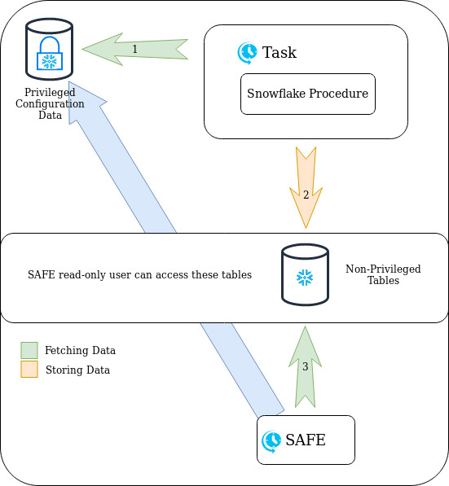
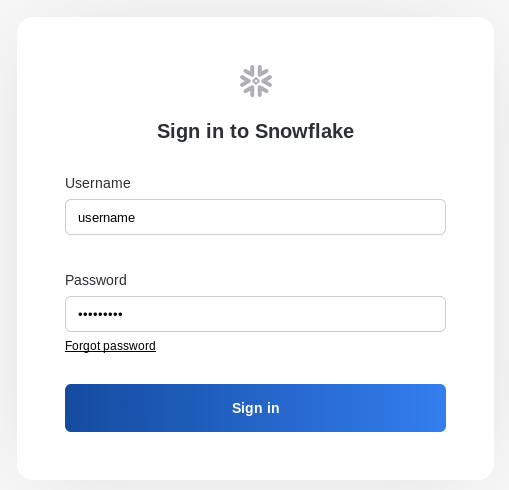
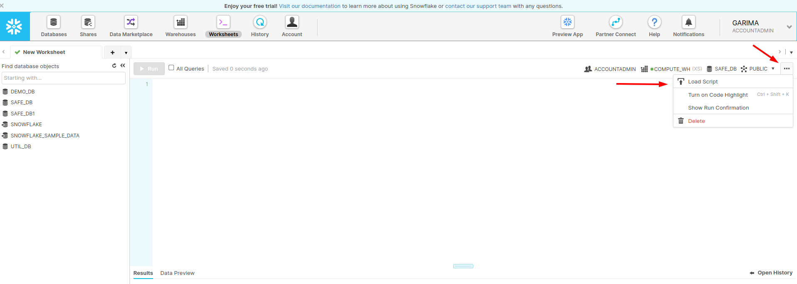
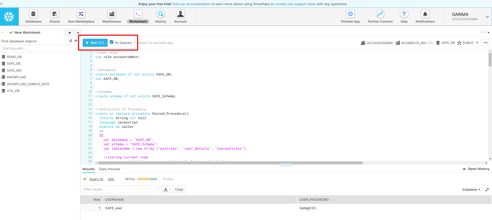
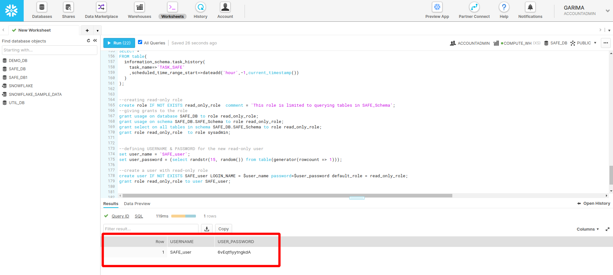

# Snowflake

## Description

Snowflake only allows ACCOUNTADMIN users to be able to execute commands on the behalf of any other user. From one perspective, this is a very useful feature, but from an auditor's perspective it makes their life a little bit complex as they don't want to use highest privileges for their audit but for snowflake they don't have a choice. It's already very difficult to find automation scripts to perform automated assessment of SaaS applications and if you create any script/tool to perform auditing of snowflake's configuration then executing scripts/tools on SaaS application with highest privileges is the biggest mistake.

We tried to implement a solution that offers a workaround to this situation by creating a *_**stored procedure**_* in your snowflake account which will run with account admin privileges, will extract the required information from all users and store it in a separate schema which can be accessed by any non-privileged read only user.

## How it works

- Create a procedure to extract required information (This step will require ACCOUNTADMIN privileges)
- Store the information in separate tables
- Create a custom read-only role and provide access to the created tables
- Create a user and assign the custom read-only role
- Create a task in your Snowflake account to execute the procedure on a periodic basis (24/48 hours)

## How to Use

NOTE: Please use ACCOUNTADMIN Credentials for the below-mentioned steps

**STEP 1**: Login to your Snowflake account with Account Admin privileges

**STEP 2**: Load the script on a fresh worksheet

**STEP 3**: Check "All Queries" and then Run

**STEP 4**: After execution of the script is complete, you username and password will be displayed on the screen

## What kind of information is made available to the Auditor?

Snowflake stored procedure was built with the intentions of performing security auditng of the SaaS application. To do that the below mentioned information is being fetched by the procedure to store in the tables accessible by the auditor:

- Configured network policies
- List of Disabled users
- Every user's Client session keepalive
- Every user's client session keep-alive heartbeat frequency
- Every Users's password expiration policy
- MFA status corresponding to every user
- Acive network policies against every user
- List of Inactive users
- List of users with password authentication enabled

NOTE: The procedure only shares the configuration details with non-privileged tables and no intellectual or proprietary data is shared to the auditor. This information can be verified at any time by the Snowflake administrators by accessing the data in the non-privileged tables.

## How to troubleshoot?

#### **1. Check whether the non-privileged tables contain the most recent data**

Execute the command mentioned below to retrieve the current date on the system:

- **select current_date();**

Execute the commands mentioned below and check whether the column **CREATED_AT** is in sync with the current date on the system

- **select * from safe_db.safe_schema.policies;**

- **select * from safe_db.safe_schema.user_details;**

- **select * from safe_db.safe_schema.userpolicies;**

#### **2. Check the time duration scheduled for the execution of the stored procedure**

Execute the command mentioned below and look for the column **schedule**

- **show terse tasks;**

#### **3. Check whether the Stored Procedure executed successfully**

Execute the command mentioned below and check for the Logs, if they are similar to the one in the picture below then the execution was successful

- **select * from safe_db.safe_schema.log_table;**

_note_: _The logs shown in the image above are for a particular timestamp_
